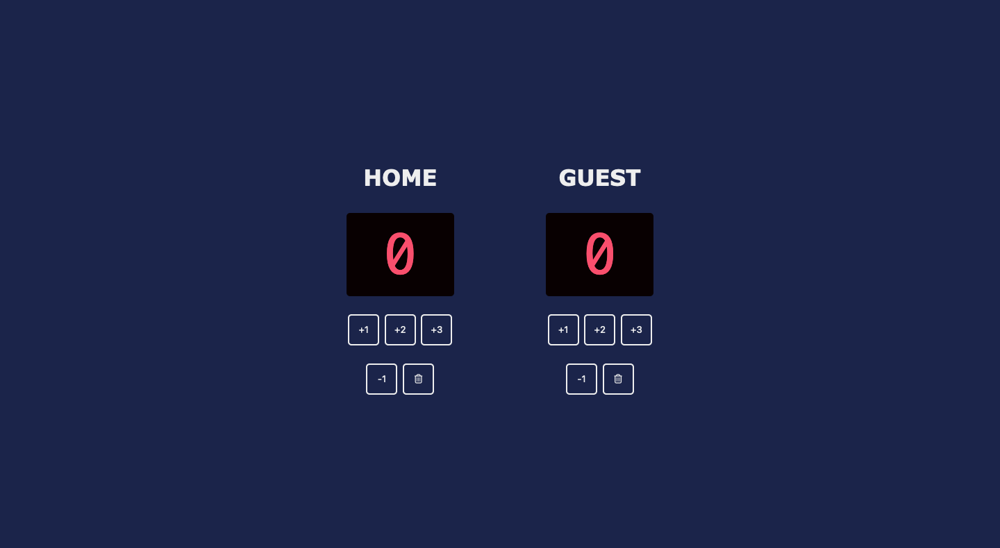

# basketball-scoreboard
My solution to the [Basketball Scoreboard solo project](https://scrimba.com/learn/frontend/solo-project-basketball-scoreboard-cz9adVfP) from [Scrimba.com's Frontend Developer Career Path](https://scrimba.com/learn/frontend).

## Contents

- [Overview](#overview)
- [Screenshot](#screenshot)
- [Status](#status)

## Overview

Build a basketball scoreboard with HTML, CSS, and JavaScript. The scoreboard should function like a real scoreboard with the ability to add points to the Home and Guest teams.

The scoreboard should have the ability to add the following points for both the Home and Guest scores:

- Add 1 point
- Add 2 points
- Add 3 points

## Screenshot

## My Process

As part of the project, a skeleton outline of the HTML and CSS files were provided, but the JavaScript was blank. I started by filling in the missing pieces in the HTLM file and then adding styling to the CSS file to match the design specifications. Finally, I added the JavaScript variables and functions to make the scoreboard functional.

The original project specifications only required the addition of points, but I added the ability to subtract a point (in case of an error) and the ability to reset the scores (without having to refresh the page).

### Built with

- HTML
- CSS
- JavaScript

## Status

Live version: [https://ananfito.github.io/basketball-scoreboard](https://ananfito.github.io/basketball-scoreboard)
